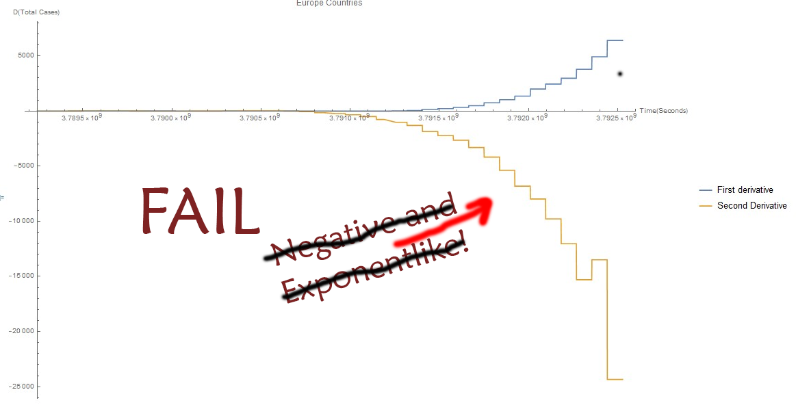
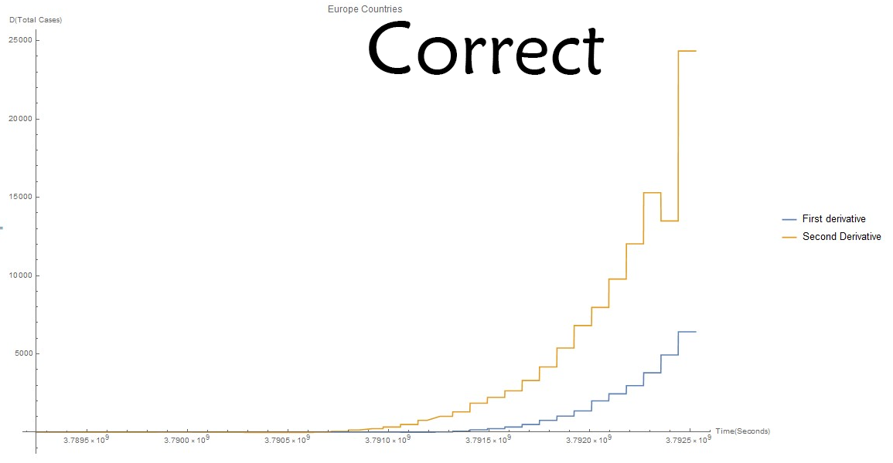

# COVID-2019 Data Exploration

Simulation of corona virus spread dynamics using Mathematica capabilities.

## Main plots

Corona virus spread is characterized by three values:

- Total __confirmed cases__.
- __Recovered__ people.
- __Deaths__.

| Worldwide plots | Europe plots |
|:-----:|:-----:|
| | |

Plots are in log scale, starting from 1 February to 15 March 2020.

Animation to better understand geography paths of virus:

| Worldwide | Europe |
|:-----:|:-----:|
| | |

ps: absolute scale of bubble is changing with time only relative sizes makes sense.

## Derivatives

To understand better dynamics of these curves let simply evaluate derivatives. First - which intuitivelly can be understood as speed, and second - as acceleration:

| <del>Worldwide</del> | <del>Europe</del> |
|:-----:|:-----:|
| | |

When I first evaluate these plots I was __amazed__!

<del>Second derivatives are negative it means that speed is slowing down, and if You take a look on Europe plot - it is sloving down exponentially like! So spreading overally in Europe is starting to slowing down.</del>

<del>And now we can extrapolate __Confirmed Cases__ curve using [logistic function](https://en.wikipedia.org/wiki/Logistic_function).</del>

UPD: Forgot "-" minus sign at evaluation of second derivative... 
It is exponential like and positive. Situation is still serious.

Correct derivative plots:

| Worldwide | Europe |
|:-----:|:-----:|
| | |

## Logistic Curve Approximation using second derivative

To be Continued...

16 March 2020.

## Further reading
- [Updated: coronavirus logistic growth model: China](https://community.wolfram.com/groups/-/m/t/1890271)
- [Coronavirus logistic growth model: Italy and South Korea](https://community.wolfram.com/groups/-/m/t/1887823)
- [Resources For Novel Coronavirus COVID-19](https://community.wolfram.com/groups/-/m/t/1872608)
- [Epidemiological Models for Influenza and COVID-19](https://community.wolfram.com/groups/-/m/t/1896178)
- [github.com/arnoudbuzing/wolfram-coronavirus](https://github.com/arnoudbuzing/wolfram-coronavirus)
